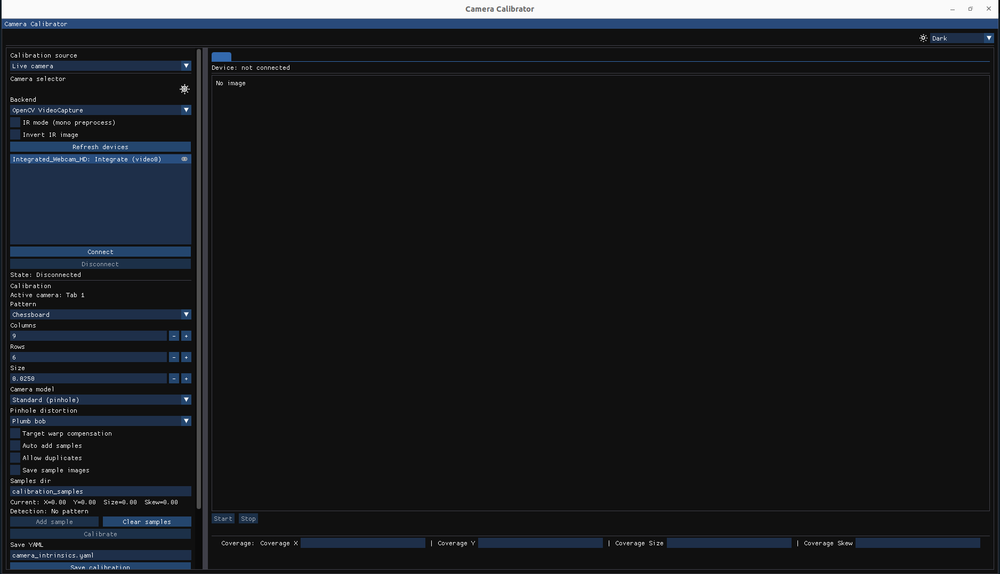
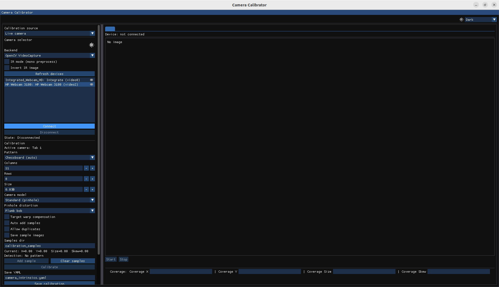

# Camera Calibrator

`camera_calibrator` is a C++ desktop application for camera calibration with a Dear ImGui UI and OpenCV calibration back-end.

It is designed for practical lab and production workflows: connect a live camera, gather diverse views, monitor coverage quality in real time, calibrate, validate reprojection quality, and export YAML files ready to use in downstream vision stacks.

## What You Can Do With This Software

### 1. Connect Cameras Through Multiple Backends
- `OpenCV VideoCapture` for common local cameras and standard video devices.
- `OpenCV GStreamer` for custom pipelines (network streams, codecs, transport-specific setups).
- `GenTL` support (Linux) by loading a `.cti` producer.
- `Aravis` support (optional) for GenICam/GigE Vision devices and richer feature access.

### 2. Run Live Monocular Calibration
- Choose pattern type: Chessboard, Chessboard SB, Symmetric Circles, Asymmetric Circles, and ChArUco (if OpenCV ArUco is available).
- Configure pattern geometry (rows, columns, square size, marker size for ChArUco).
- Track real-time quality indicators:
  - Detection status
  - Current sample metrics (`X`, `Y`, `Size`, `Skew`)
  - Inline coverage row (`Coverage X/Y/Size/Skew`) under the visualization panel
- Add samples manually or use auto-add mode.
- Optionally allow duplicates or enforce more sample diversity.
- Optionally save accepted sample images to disk.

### 3. Use Reproducible Offline Calibration Inputs
- Calibrate from an image folder (step through frames manually).
- Calibrate from a video file (open + step frame by frame).
- Keep experiments reproducible without requiring a live stream.

### 4. Use IR-Oriented Preprocessing
- Mono preprocessing for IR streams.
- Invert polarity for thermal/IR cases where corner contrast is reversed.
- Available in both live and offline workflows.

### 5. Select Calibration Models and Robust Options
- Camera model:
  - Standard pinhole
  - Fisheye
  - Omnidir / Mei model for FOV > 180° (when OpenCV contrib `ccalib` is available)
- Pinhole distortion model:
  - Plumb bob
  - Rational polynomial
- Target warp compensation for non-perfectly planar calibration boards.
- Robust calibration behavior with outlier handling and per-view error analysis.

### 6. Run Stereo Calibration
- Enable stereo pair mode and select left/right camera slots.
- Configure timestamp sync tolerance.
- Optionally provide expected baseline.
- Optionally fix intrinsics during stereo solve.
- Export stereo calibration including rectification matrices/maps.

### 7. Inspect Quality and Export Results
- Calibration status and sample counters.
- RMS, inliers/rejected samples, mean/median/P95 reprojection errors.
- Per-view RMS histogram and worst-view listing.
- Spatial residual heatmap.
- Save monocular and stereo results as YAML files.

## Screenshots




## Requirements

- CMake 3.20+
- OpenCV 4.8+
- OpenGL
- GLFW
- Threads (system)
- pkg-config

Optional:
- Aravis 0.8+ (GenICam/GigE Vision support)
- GenTL producer (`.cti`) for GenTL backend
- OpenCV ArUco module (for ChArUco)
- OpenCV contrib `ccalib` / `omnidir` module (for omnidirectional calibration with FOV > 180°)

Notes:
- CMake fetches Dear ImGui and GLFW automatically if not found locally (internet access required at configure time).

## Optional Dependencies

### OpenCV + contrib (pinned version)

If you want to install a pinned OpenCV version (with contrib modules), use:

```bash
./scripts/build_opencv_contrib_world.sh <OPENCV_VERSION>
```

Examples:

```bash
./scripts/build_opencv_contrib_world.sh 4.10.0
./scripts/build_opencv_contrib_world.sh 4.10.0 --keep-workroot
./scripts/build_opencv_contrib_world.sh 4.9.0 --prefix /usr/local/opencv-4.9.0 --nonfree
./scripts/build_opencv_contrib_world.sh 4.10.0 --clean
./scripts/build_opencv_contrib_world.sh 4.10.0 --cuda
```

Main options:
- `--prefix <path>`: install prefix (default: `/usr/local/opencv-<VERSION>`).
- `--clean`: remove that version work tree and rebuild.
- `--nonfree`: enable `OPENCV_ENABLE_NONFREE`.
- `--cuda`: attempt CUDA build (requires CUDA toolchain already installed).
- `--keep-workroot`: keep temporary work tree after a successful build.

What the script does:
- Installs required build dependencies on Ubuntu.
- Downloads matching `opencv` and `opencv_contrib` sources.
- Builds and installs OpenCV (`opencv_world`) with contrib modules.
- Installs environment helper scripts in the chosen prefix:
  - `<PREFIX>/env.sh`
  - `<PREFIX>/env.bash`
  - `<PREFIX>/env.zsh`

After installation, load the environment:

```bash
source /usr/local/opencv-4.10.0/env.bash
# or (zsh)
source /usr/local/opencv-4.10.0/env.zsh
```

Then verify:

```bash
opencv_version
pkg-config --modversion opencv4
```

### Aravis on Ubuntu

```bash
./scripts/install_aravis_ubuntu.sh
```

Then reconfigure CMake so `HAVE_ARAVIS` is detected.

## Build

```bash
cmake -S . -B build
cmake --build build -j
```

Run:

```bash
./build/camera_calibrator
```

## Project Structure

- `include/core/`: frame primitives and ring buffer headers.
- `include/camera/`: camera abstractions and backend interfaces.
- `include/processing/`: pattern and calibration interfaces.
- `include/ui/`: UI interface headers.
- `src/core/`: core implementation files (if present).
- `src/camera/`: camera/backend implementations.
- `src/processing/`: detection and calibration implementations.
- `src/ui/`: Dear ImGui application/rendering code.
- `scripts/`: helper scripts.

## References

- Lensboy:
  https://github.com/Robertleoj/lensboy
- ROS Camera Calibration:
  https://wiki.ros.org/camera_calibration
- ROS image_pipeline camera_calibration:
  https://github.com/ros-perception/image_pipeline/tree/noetic/camera_calibration
- ROS 2 camera_calibration docs:
  https://docs.ros.org/en/rolling/p/camera_calibration/
- OpenCV calib3d:
  https://docs.opencv.org/4.x/d9/d0c/group__calib3d.html
- OpenCV Video I/O backends:
  https://docs.opencv.org/4.x/d4/d15/group__videoio__flags__base.html
- OpenCV GStreamer backend implementation:
  https://github.com/opencv/opencv/blob/4.x/modules/videoio/src/cap_gstreamer.cpp
- OpenCV fisheye model:
  https://docs.opencv.org/4.x/db/d58/group__calib3d__fisheye.html
- OpenCV omnidirectional calibration:
  https://docs.opencv.org/4.x/dd/d12/tutorial_omnidir_calib_main.html
- OpenCV ArUco/ChArUco calibration:
  https://docs.opencv.org/4.x/da/d13/tutorial_aruco_calibration.html
- OpenCV camera calibration tutorial:
  https://docs.opencv.org/4.x/d4/d94/tutorial_camera_calibration.html
- IR geometric calibration review:
  https://www.mdpi.com/1424-8220/23/7/3479
- Checkerboard detection for thermal IR calibration:
  https://jsss.copernicus.org/articles/10/207/2021/
- DOI:
  https://doi.org/10.5194/jsss-10-207-2021

## License

This project source code is licensed under the MIT License. See [LICENSE](LICENSE) for details.

Third-party dependencies are distributed under their own licenses. See [THIRD_PARTY_NOTICES.md](THIRD_PARTY_NOTICES.md) for license details and redistribution notes.

## Contact

Javier Curado Soriano
